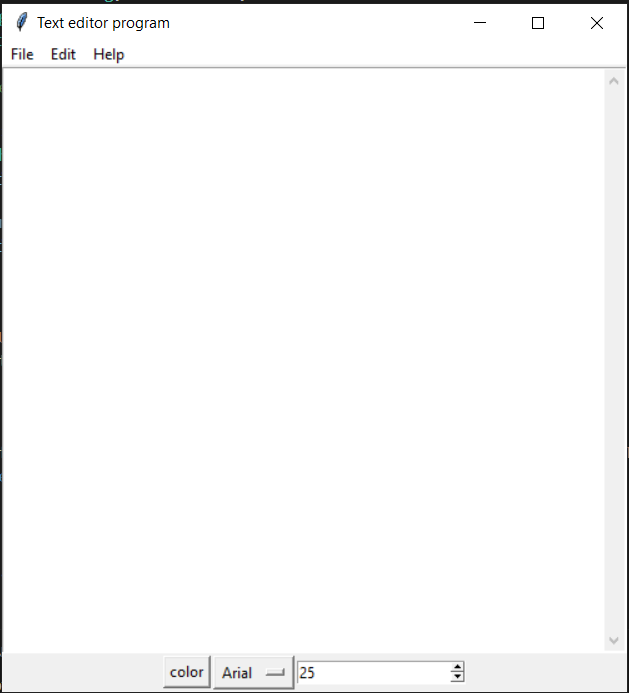

# CodeClause_TextEditor_Task2
Text editor in Python using tkinter GUI toolkit. this is allowcated project by [Codeclause](https://codeclause.com/) 

Author: Rohan Kadam

Github: https://github.com/KRohancoder

# Discription 📀
Text Editor: In Tkinter, Text Editor is the widget used for getting user inputs or for users to write their response as text. Some applications of text editors are: notepad, word pad etc. Tkinter also have Text editor widget that we can use in our application to enhance or to expand its functionality.Python provides vast number of libraries for GUI application development. Tkinter is the widely used library for GUI application development. Using Tkinter library of python which carries large numbers of widgets, we can easily create Graphical User Interface for our application.

# Project Difficulty level 🥇
Beginner

# Programming Language 🐍
Python

# Domain 🏥
Application

# Tools 🛠
This project requires that you have Python installed. Download it here.

It also requires the following Python packages, which can be installed via pip:

tkinter==8.6

Then run it by double clicking on text_editor.py!

# Features !

- Various themes are available.
- All required font styles and colours.
- Copy and paste text
- Save Easily in txt format

# Editor's Interface Screenshot

=======================================================================

## 📌 Opensource Programs

### [This project is a part of following Open Source Program](https://codeclause.com/)

=======================================================================

# Contributing
Pull requests are welcome. If someone wants to contribute to this project can fork and add the Functionalities Or enhance the GUI.

## Happy Contribution ✨
